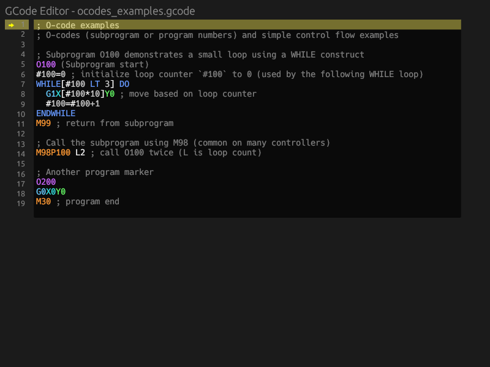
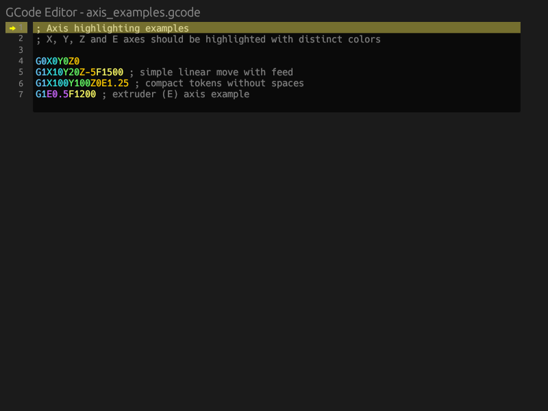
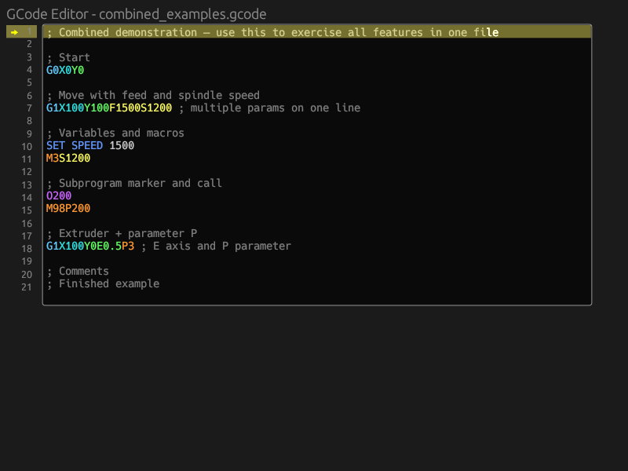
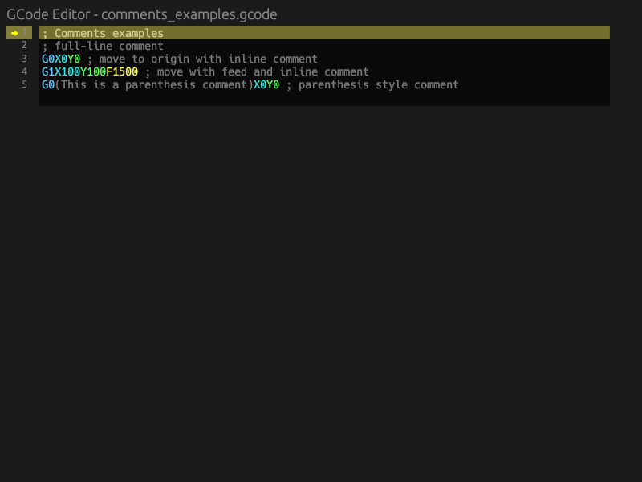
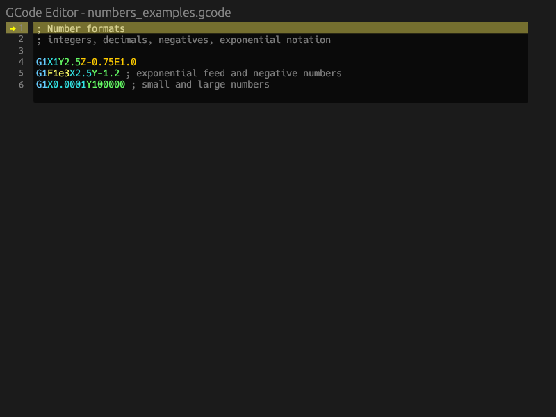
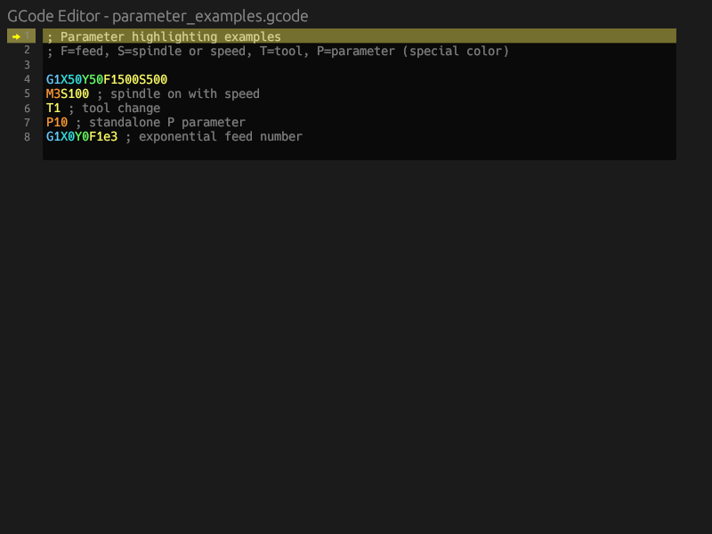
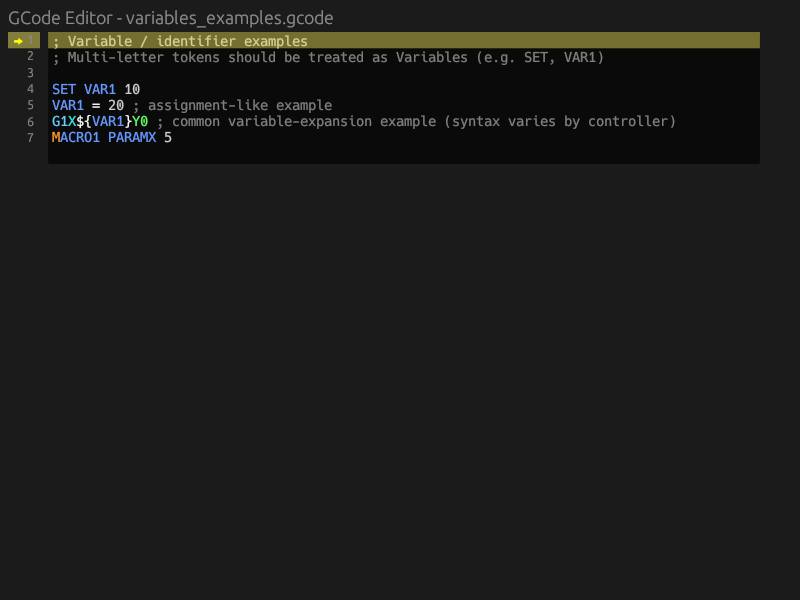

# gcode_editor

Lightweight, egui-based GCode editor component with syntax highlighting, gutter line numbers, active-line support, and small pure-Rust tokenizer for environments that don't supply a highlighter.

---

## Features

- Syntax highlighting (per-token colors, per-axis colors for X/Y/Z/E, special color for `P` parameter)
- Optional gutter with line numbers and active-line arrow
- Active-line background highlight (configurable color)
- Click-to-line mapping (accurate to font layout)
- Events emitted for content change, selection change and active-line change
- Example app using `eframe` in `examples/simple_editor.rs`
- Small pure-Rust tokenizer + unit tests (no external C highlighting required)



---

## Quick start (example)

Run the GUI example:

```sh
cargo run --example simple_editor
```

The example enables line numbers and active-line background by default so you can try clicking the gutter and editing the text.

---

## Web example

Run the web-based example in your browser:

```sh
# Install the WebAssembly target
rustup target add wasm32-unknown-unknown

# Install trunk (web build tool)
cargo install trunk

# Run the web example
trunk serve --open --example web_editor
```

The web editor will open in your default browser with syntax highlighting, line numbers, and additional web-specific features like copy-to-clipboard and statistics.


---

## Embedding API (short reference)

Add the editor into an egui `Ui`:

```rust
use gcode_editor::{EditorState, SyntaxColors, show_editor, EditorEvent};

let mut state = EditorState::default();
let colors = SyntaxColors::default();
let mut content = String::from("G0 X0 Y0\nG1 X100 Y100 F1500\n");

// In your egui frame:
let events: Vec<EditorEvent> = show_editor(ui, &mut content, &mut state, &colors, 14.0);
for evt in events {
    match evt {
        EditorEvent::ContentChanged(c) => println!("content changed: {} bytes", c.new_content.len()),
        EditorEvent::ActiveLineChanged { old, new } => println!("active line {:?} -> {:?}", old, new),
        EditorEvent::SelectionChanged { old, new } => println!("selection changed {:?} -> {:?}", old, new),
    }
}
```

---

## EditorState helpers

- `EditorState::default()` — create default state.
- `state.show_line_numbers = true;` — show gutter with line numbers.
- `state.active_line = Some(n);` — set active line (1-based) programmatically.
- `state.show_active_line_bg = true;` — enable active-line background highlight.
- `state.active_line_bg = [r, g, b, a];` — set RGBA color (0.0..1.0) for active-line background.
- `state.set_syntax_highlighting(enabled: bool);` — enable/disable syntax highlighting at runtime.
- `state.syntax_highlighting_enabled()` — query current state.
- Convenience color helpers that mutate a `SyntaxColors` instance:
  - `state.set_axis_color(&mut colors, 'X', rgba);`
  - `state.set_p_parameter_color(&mut colors, rgba);`

---

## SyntaxColors

`SyntaxColors` holds the color arrays for token types, including `x_axis`, `y_axis`, `z_axis`, `e_axis`, and `p_parameter`. Customize them before passing to `show_editor`.

Example:

```rust
let mut colors = SyntaxColors::default();
colors.x_axis = [1.0, 0.0, 0.0, 1.0]; // red X axis
colors.p_parameter = [0.0, 1.0, 0.0, 1.0]; // green P
```

---

## Events

`show_editor` returns `Vec<EditorEvent>` per UI update:
- `EditorEvent::ContentChanged(EditorChangeEvent)` — text changed
- `EditorEvent::ActiveLineChanged { old, new }` — active line changed (1-based)
- `EditorEvent::SelectionChanged { old, new }` — selection changed

Handle them in your app to react to edits or navigation.

---

## Error Marking API 🛑

The editor provides a lightweight API so embedding apps can *mark* regions of the content as syntax errors (visualized with a red background). The library does not attempt to parse G-code for you — it simply stores ranges and renders them. Tooltips may be attached to error ranges and will be shown on hover.

Key types & concepts
- `ErrorRange { id: u64, start: usize, end: usize, tooltip: Option<String> }` — represents a marked error by byte offsets into the current content. `id` is a unique identifier assigned when the range is added.

API methods (on `EditorState`)
- `add_error_range_bytes(start, end) -> u64` — add an error given byte offsets; returns the `id`.
- `add_error_range_bytes_with_tooltip(start, end, tooltip) -> u64` — same as above, with a tooltip string.
- `add_error_range_line_col(line_one_based, start_col, end_col, content)` — add an error that only covers part of a single line (columns are character indices).
- `add_error_from_selection(content)` — add an error covering the current selection (if any).
- `add_error_for_line(line_one_based, content)` — mark the entire line as an error.
- `remove_error_range(id) -> bool` — remove an error by id.
- `update_error_range(id, start, end, tooltip) -> bool` — change an existing error.
- `set_error_ranges(Vec<ErrorRange>)` — replace all ranges.
- `clear_error_ranges()` — remove all ranges.

Rendering & behavior
- Error ranges are drawn with a red background and are hover-interactive. If the `ErrorRange.tooltip` is Some(text), the text will appear in a tooltip when the user hovers the highlighted region.
- The library does not automatically reconcile error ranges when the content changes. If your app performs edits, you should update or remove ranges as appropriate.

Quick example (mark a token as error with a tooltip):

```rust
// `content` is a String with current editor text and `state` is EditorState
if let Some(start) = content.find("Xabc") {
    let end = start + "Xabc".len();
    let id = state.add_error_range_bytes_with_tooltip(start, end, "Invalid numeric value for axis X");
    // store `id` if you want to remove or update this range later
}
```

You can remove the range later:

```rust
state.remove_error_range(id);
```

Tip: for partial-line errors, use `add_error_range_line_col(line, start_col, end_col, &content);` where columns are character indices (0-based).

---

## Helpers & Tests

- `color_for_token(colors, token_type) -> egui::Color32` — map TokenType to a Color32.
- `click_y_to_line_index(rel_y, top_padding, row_height, n_lines) -> usize` — helper used internally to map gutter Y position to line index (exposed for testing).

Unit tests are included and can be run with:

```sh
cargo test --lib
```

---

## Examples and sample files

- `examples/simple_editor.rs` — runnable GUI example
- `examples/gcode/` — small G-code files showcasing features (axis/parameters/comments/ocodes/numbers/combined).

---

## Screenshots

The editor with various G-code examples:

### Axis Examples


### Combined Examples


### Comments Examples


### Numbers Examples


### O-Codes Examples


### Parameter Examples


### Variables Examples


---

## Generating screenshots

Generate screenshots of the editor with all example G-code files:

```sh
./scripts/generate_screenshots.sh
```

This script:
- Uses Xvfb for headless operation (works on systems without a display)
- Captures only the egui window (not the entire screen)
- Saves screenshots to the `screenshots/` directory

**Requirements:**
- Xvfb: `sudo apt-get install xvfb`
- ImageMagick: `sudo apt-get install imagemagick`
- x11-utils: `sudo apt-get install x11-utils`

---

## Contribution

Contributions, bug reports and feature requests welcome. If you add new token types or change tokenizer behavior, please add unit tests for tokenization and colors.
